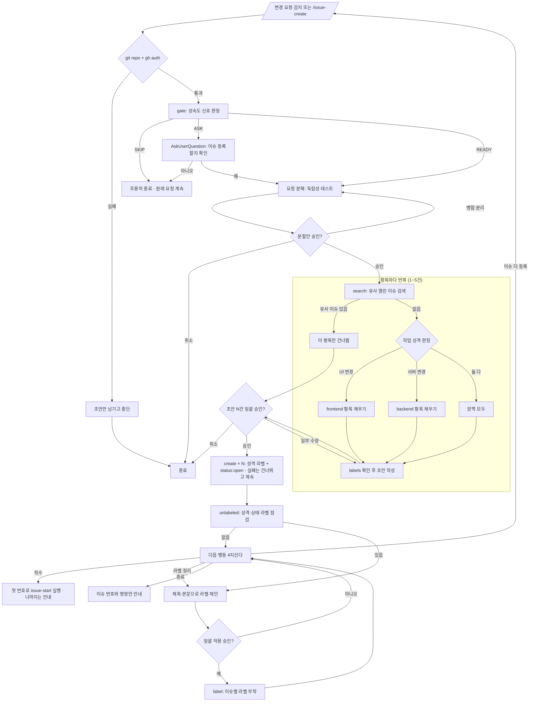

<skill>
  <purpose>
    사용자의 변경 요청이 기본 브랜치에서 바로 시작되지 않게 막고, 먼저 이슈로 등록한다.
    등록할 만한 프로젝트인지 판정하고, 요청 안에 독립 작업이 여러 개면 그만큼 나누고,
    항목마다 중복을 확인한 뒤 착수 분석에 바로 쓸 수 있는 이슈를 만들어 번호를 넘긴다.
    이슈 하나 = 워크트리 하나 = PR 하나가 뒤 단계의 전제라, 뭉친 이슈는 뒤에서 전부 엉킨다.
    이슈 등록이 유일한 목표다. 계획·구현·증거는 전부 `issue-start` 의 몫이다.
  </purpose>

  <inputs>
    <arg name="$ARGUMENTS" required="false">만들 이슈의 내용. 생략하면 직전 대화의 변경 요청을 그대로 쓴다</arg>
  </inputs>

  <preconditions>
    <item>현재 디렉터리가 git 저장소</item>
    <item>트래커 인증 통과 — `~/.issue/settings.json` 의 `provider.type` 이 github 면 `gh auth status`, jira 면 baseUrl·projectKey·토큰. github 인증 실패는 `gh-setup` 스킬로 먼저 끝낸다</item>
    <item>git, Node 18+</item>
  </preconditions>

  <routing>
    <always>references/provider-settings.md — 이슈 백엔드(github / jira) 설정</always>
    <always>references/maturity-gate.md — 이슈를 만들 단계인지 판정</always>
    <always>references/split-requests.md — 요청을 이슈 몇 개로 나눌지 판정</always>
    <always>references/issue-draft.md — 초안 작성과 라벨 선택</always>
    <always>references/label-audit.md — 라벨 부착과 기존 이슈 라벨 점검</always>
    <always>references/create-and-handoff.md — 등록과 issue-start 인계</always>
  </routing>

  <subagents>
    <agent name="issue-verifier" claude-model="haiku" codex-model="gpt-5.6-luna">
      전제 확인 · 유사 이슈 중복 검사 · 작업 성격 판정.
      분해된 항목이 여러 개면 항목마다 하나씩 병렬로 띄운다.
    </agent>
  </subagents>

  <hard-rules>
    <rule>코드를 수정하지 않는다. 이슈 생성까지만 한다.</rule>
    <rule>복합 요청을 이슈 하나에 뭉치지 않는다. 독립성 테스트를 통과한 만큼 쪼갠다.</rule>
    <rule>분할안을 승인받기 전에는 초안을 쓰지 않는다. 승인은 분할안 · 초안 두 번 받는다.</rule>
    <rule>등록은 항목마다 `create` 를 따로 호출한다. 한 번의 호출로 여러 이슈를 만들 수 없다.</rule>
    <rule>초안을 보여주고 승인받기 전에는 이슈를 등록하지 않는다.</rule>
    <rule>성숙도 게이트가 SKIP 이면 조용히 빠지고 원래 요청을 방해하지 않는다.</rule>
    <rule>사용자가 `/issue-create` 를 직접 호출하면 게이트를 건너뛴다.</rule>
    <rule>유사한 열린 이슈가 있으면 새로 만들지 않고 그 번호를 제시한다.
      항목이 여러 개면 중복인 항목만 빼고 나머지는 그대로 진행한다.</rule>
    <rule>만든 이슈에는 성격 라벨을 반드시 하나 이상 붙인다. 스크립트가 성격 라벨 없는 `create` 를 exit 2 로 막는다.</rule>
    <rule>진행 상태 라벨(`status:*`)은 상호배타다. 바꿀 때는 `status` 명령으로 교체하고, 직접 add/remove 를 조합하지 않는다.</rule>
    <rule>상태 전환 실패는 흐름을 막지 않는다. 경고만 남기고 진행한 뒤 마무리 보고에 적는다.</rule>
    <rule>라벨을 새로 만들거나 기존 이슈의 라벨을 바꾸는 것은 사용자 승인 후에만 한다. `status:open` 자동 부착은 예외다.</rule>
    <rule>이슈 상태 변경, 코멘트 작성, PR 생성을 하지 않는다.</rule>
  </hard-rules>

  <handoff>
    이슈를 만든 뒤 착수 여부를 묻고, 예면 같은 번호로 `issue-start` 를 이어서 실행한다.
    여러 건이면 첫 번호로만 이어가고 나머지 번호는 안내만 한다. 동시에 착수하지 않는다.
    `.issue/<번호>/request.md` 에 원본 요청을 남겨 `issue-start` 의 대조 분석이 재사용한다.
    `.gitignore` 의 `.issue` 블록은 등록 시 자동으로 들어간다.
    흐름은 `issue-create` → `issue-start` → `issue-end` → `issue-merge`.
  </handoff>

  <reporting>
    이슈·PR·코멘트는 `[설명](링크)` 로 쓴다. `링크와 경로 쓰는 법` 참고.
    문제가 생기면 상황 → 문제 → 멀쩡한 것 → 원인 → 선택 순서로 쉬운 말로 보고하고, 마지막은 AskUserQuestion 으로 닫는다.
  </reporting>

  <next>
    끝날 때는 항상 다음에 무엇을 할지 골라 준다. references/next-actions.md 의 4지선다를 그대로 쓴다.

    (권장) 은 다음 스킬에 자동으로 붙지 않는다. 남은 작업이 있으면 계속하는 쪽이,
    사용자가 원래 요청한 산출물이 이미 나왔으면 종료하는 쪽이 (권장) 이다.
    이 체인은 스킬마다 다음 스킬을 제시하므로, 기본값을 계속 진행으로 두면
    "검증만 해 달라"는 요청이 이슈·PR·merge 까지 흘러간다. 판단해서 붙인다.
  </next>
</skill>

# 전체 흐름



# 스크립트 경로

아래 중 **존재하는 첫 번째 경로**를 `<skill>` 로 쓴다. 하나도 없으면 각 레퍼런스의 인라인 절차를 그대로 수행한다.

```text
.claude/skills/issue-create      # 현재 프로젝트 (Claude Code)
.codex/skills/issue-create       # 현재 프로젝트 (Codex)
~/.claude/skills/issue-create    # 홈 설치
~/.codex/skills/issue-create     # 홈 설치
```

`<skill>` 이 `.claude/` 밑이면 실행 계열은 **claude**, `.codex/` 밑이면 **codex** 다. 이 판별로 서브에이전트 모델을 고른다.

# 서브에이전트

전제 확인 · 중복 검사 · 성격 판정은 판정성 작업이라 값싼 모델에 맡긴다.

```text
claude  .claude/agents/issue-verifier.md   (model: haiku)
codex   .codex/agents/issue-verifier.toml  (model = "gpt-5.6-luna")
```

없으면 `migrate-skill-agent.sh --agent issue-verifier --target home --link --clone` 으로 설치한다.
실패하면 기본 서브에이전트로 진행하고 "모델 고정 실패"를 한 줄 보고한다.

# 실행 순서

## 0단계 — 전제 확인

```bash
git rev-parse --show-toplevel
```

트래커 인증은 스크립트가 알아서 확인한다. `create` 를 뺀 모든 모드는 인증이 안 되어 있으면
**exit 4** 로 빠지면서 무엇을 채워야 하는지 알려 준다.

```text
provider.type = github   gh 인증. 실패하면 `gh-setup` 스킬로 설치·로그인을 끝낸 뒤 이어서 진행
provider.type = jira     ~/.issue/settings.json 의 provider.jira (baseUrl·projectKey·email)
                         + tokenEnv 가 가리키는 환경변수
```

`gh-setup` 이 없는 환경이면 그 사실을 알리고, 이슈 본문 초안만 마크다운으로 남긴 뒤 중단한다.
git 저장소가 아니면 그대로 중단한다.

## 1단계 — 성숙도 게이트

```bash
node <skill>/scripts/issue-create.mjs gate
```

`VERDICT` 에 따라 갈린다.

```text
READY   바로 2단계로 진행
ASK     AskUserQuestion 으로 한 번 확인. 아니면 종료
SKIP    아무 말 없이 종료하고 원래 요청을 그대로 수행
```

판정 기준은 `references/maturity-gate.md`. 사용자가 `/issue-create` 를 직접 호출했으면 이 단계를 건너뛴다.

## 2단계 — 요청 분해와 분할안 승인

`references/split-requests.md` 를 따른다. 요청 안에 독립 작업이 여러 개면 그만큼 나눈다.

```text
독립성 테스트   따로 머지 가능 / 완료 기준 안 겹침 / 하나 취소돼도 성립 / 라벨 성격 갈림
                넷 다 만족해야 쪼갠다. 하나라도 아니면 단일 이슈 + 체크리스트
상한            5개. 넘으면 묶을지 한 번 묻는다
```

작업이 하나뿐이면 이 단계를 건너뛰고 3단계로 간다.
여러 개면 **제목 + 한 줄 요약 + 예상 라벨** 목록만 보여주고 AskUserQuestion 으로 승인 / 병합 / 분리 / 취소를 받는다.
본문은 아직 쓰지 않는다.

## 3단계 — 항목별 중복 검사

확정된 항목마다 따로 돈다.

```bash
node <skill>/scripts/issue-create.mjs search "<항목 키워드>"
```

`MATCHES` 가 0 이 아니고 내용이 겹치면 그 번호와 제목을 보여주고, **그 항목만 빼고** 나머지를 진행한다.
빠진 항목은 마무리 보고의 `건너뜀` 줄에 남긴다. 항목이 하나뿐이었다면 `/issue-start #N` 을 제안하고 종료한다.
겹치는지 애매하면 AskUserQuestion 으로 "기존 이슈에 붙일지 / 새로 만들지" 를 묻는다.

## 4단계 — 항목별 작업 성격 판정

`issue-start` 3단계와 같은 신호를 쓴다. 판정 결과가 본문 항목과 라벨을 결정한다.

```text
frontend 신호   화면·버튼·레이아웃·반응형·깨짐, 스크린샷이 있는 요청
backend 신호    API·쿼리·성능·타임아웃·정합성·배치
both            사용자 플로우 전체를 다루거나 API 계약 변경이 화면에 영향
```

항목마다 성격이 다를 수 있다. 요청 전체로 뭉뚱그려 판정하지 않는다.

## 5단계 — 초안 작성과 일괄 승인

`references/issue-draft.md` 를 따른다. 저장소에 이슈 템플릿이 있으면 그것을 우선한다.
항목마다 초안을 채우고 **전문을 한 번에** 보여준 뒤, AskUserQuestion 으로 일괄 승인 / 일부 수정 / 취소를 받는다.

## 6단계 — 등록

`references/create-and-handoff.md` 를 따른다. **성격 라벨 없이 등록하지 않는다.**
쓸 라벨이 저장소에 하나도 없으면 `references/label-audit.md` 의 라벨 생성 절차를 먼저 밟는다.

항목마다 `create` 를 따로 호출한다. 실패한 항목은 **건너뛰고 계속** 하고, 성공·실패를 모아 마지막에 한 번 보고한다.
`status:open` 은 등록 성공 직후 스크립트가 자동으로 붙인다. `--label` 로 직접 넘기지 않는다.

## 7단계 — 기존 이슈 라벨 점검

```bash
node <skill>/scripts/issue-create.mjs unlabeled --state open
```

출력은 두 축으로 나뉜다. `UNLABELED_NUMBERS`는 성격 라벨이 없는 이슈이고, `NO_STATUS_NUMBERS`는 진행 상태 라벨이 없는 이슈다. 둘 다 0 이면 그대로 넘어간다. 아니면 제목·본문과 PR·브랜치 상태를 읽어 제안 목록을 만들고 AskUserQuestion으로 한 번에 승인받아 붙인다. 세부는 `references/label-audit.md`.

## 8단계 — 다음 행동

`references/next-actions.md` 의 4지선다를 그대로 제시한다. "바로 착수" 를 고르면 첫 번호로 `issue-start` 를 이어서 실행하고 나머지 번호는 안내만 한다. 워크트리가 충돌하므로 여러 이슈를 동시에 착수하지 않는다.

## 마무리 보고

한 건일 때.

```text
이슈      [#{issue_number} <제목>](<이슈 URL>)
라벨      <붙인 성격 라벨> + status:open
라벨 점검  성격 <n>건 확인 / <m>건 보정, 상태 <p>건 확인 / <q>건 보정
기본 브랜치 <base> (<판별 출처>)
요청 기록  .issue/{issue_number}/request.md
다음      <사용자가 고른 행동>
```

여러 건일 때.

```text
이슈      #61 대시보드 기간 필터 추가        (enhancement)
          #62 주문 목록 빈 렌더링 수정        (bug)
          #63 레거시 export 스크립트 제거      (chore)
건너뜀    "알림 배지" — #48 과 중복
실패      없음
라벨 점검  성격 12건 확인 / 3건 보정, 상태 <p>건 확인 / <q>건 보정
요청 기록  .issue/{61,62,63}/request.md
다음      <사용자가 고른 행동> — /issue-start #61 (이후 #62, #63)
```

`건너뜀` 과 `실패` 는 해당 항목이 없으면 줄 자체를 뺀다.
