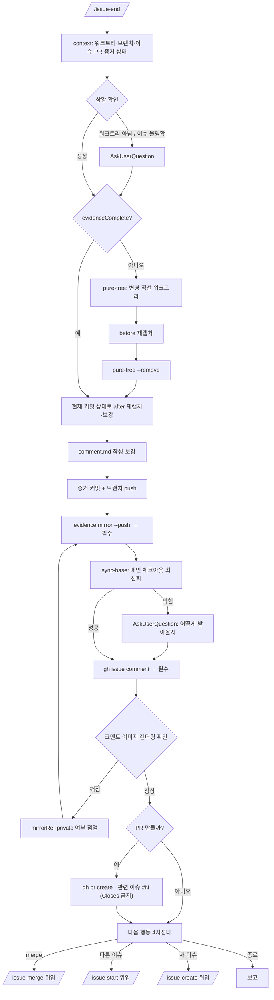

<skill>
  <purpose>
    구현이 끝난 작업을 남들이 검증할 수 있는 상태로 만든다.
    증거를 재확인하고, 기본 브랜치에 증거와 리포트를 남기고, 이슈에 코멘트하고, PR 을 만든다.
    merge 는 하지 않는다. 여러 워크트리를 동시에 굴리는 것이 이 스킬군의 전제이기 때문이다.
  </purpose>

  <inputs>
    <arg name="$ARGUMENTS" optional="true">이슈 번호(`#59`, `59`, URL). 생략하면 브랜치 이름에서 추론</arg>
    <detected>워크트리 여부, 브랜치, 이슈 번호, 기존 PR, 증거 완결성</detected>
  </inputs>

  <preconditions>
    <item>현재 디렉터리가 git 저장소</item>
    <item>트래커 인증 통과 — `~/.issue/settings.json` 의 `provider.type` 이 github 면 `gh auth status`, jira 면 baseUrl·projectKey·토큰. github 인증 실패는 `gh-setup` 스킬로 먼저 해결</item>
    <item>Node 18+. 재캡처가 필요하면 Playwright 와 sharp/cwebp/ffmpeg 중 하나</item>
  </preconditions>

  <routing>
    <always>references/context-triage.md — 상황 판단과 확인 질문</always>
    <always>references/evidence-recheck.md — 증거 완결성 검사와 pure-tree 재캡처</always>
    <always>references/report-and-pr.md — 기본 브랜치 증거 커밋 · 이슈 코멘트 · PR</always>
    <always>references/next-actions.md — 다음 행동 4지선다와 issue-merge 위임</always>
  </routing>

  <subagents>
    <agent name="issue-verifier" claude-model="haiku" codex-model="gpt-5.6-luna">
      증거 완결성 점검 · 작업 성격 재판정
    </agent>
  </subagents>

  <hard-rules>
    <rule>이슈에 결과를 코멘트하는 8단계는 필수다. 건너뛰지 않는다.
      6단계(기본 브랜치 미러)는 **이미지를 코멘트에 싣는 경우에만** 필요하다.
      `issue-start route` 의 `MIRROR_EVIDENCE=0` 이면 — private 저장소이거나 증거가 L2 가 아니면 —
      미러할 이미지가 없으므로 이 단계는 해당 없음이고, 사용자에게 예외 승인을 받을 일도 아니다.
      그 사실을 마무리 보고의 `미러` 줄에 사유와 함께 적는다.</rule>
    <rule>증거가 없으면 PR 을 만들지 않는다. 왜 만들 수 없는지 보고하고 멈춘다.</rule>
    <rule>merge 를 실행하지 않는다. 요청받으면 `issue-merge` 로 위임한다.</rule>
    <rule>워크트리를 삭제하지 않는다. 정리는 `issue-merge` 가 통합 후에 한다.</rule>
    <rule>사용자가 정해야 할 것은 전부 AskUserQuestion 으로 묻는다. 평문 질문으로 끝내지 않는다.</rule>
    <rule>push 와 PR 생성은 각각 따로 AskUserQuestion 으로 확인받는다. 묶어서 승인받지 않는다.</rule>
    <rule>현재 워크트리에서 브랜치를 갈아타지 않는다. 기본 브랜치 작업은 임시 워크트리에서 한다.</rule>
    <rule>이슈 번호를 확정하지 못한 상태에서 임의의 이슈에 코멘트하지 않는다.</rule>
    <rule>측정값과 캡처를 지어내지 않는다. 악화된 지표도 그대로 적는다.</rule>
    <rule>미러 push 뒤 메인 체크아웃 최신화를 시도한다. 막히면 사용자와 함께 정하고, 확인 없이 치워두거나 브랜치를 갈아타지 않는다.</rule>
    <rule>사용자에게 말을 걸 때는 — 전이 보고든 질문이든 — 현재 단계를 반드시 함께 밝힌다.
      본문이 5줄 미만이면 앞에, 5줄 이상이면 마지막 줄에 둔다. 형식은 `# 현재 단계 밝히기` 를 따른다.</rule>
  </hard-rules>

  <non-goals>
    <item>기능 구현 — `issue-start` 의 몫</item>
    <item>merge 와 워크트리 정리 — `issue-merge` 의 몫</item>
    <item>이슈 본문 수정 — 코멘트만 단다</item>
  </non-goals>

  <reporting>
    문제가 생기면 아래 순서를 그대로 지켜 보고한다. 세 스킬(issue-start / issue-end / issue-merge)이 같은 형식을 쓴다.

    1. 쉬운 말로 쓴다. 전문 용어를 쓸 거면 바로 옆에 풀어 준다.
    2. 지금 무슨 상황인지부터 말한다.
    3. 무엇이 잘못됐는지 말한다.
    4. 잘못되지 않은 것도 말한다 — 무엇은 멀쩡한지 짚어 준다.
    5. 사용자가 정해야 할 것을 고를 수 있게 물어본다. AskUserQuestion 을 쓴다.
    6. 이슈·PR·코멘트는 `[설명](링크)` 로, 워크트리 경로는 배치에 맞는 형태로 쓴다. `링크와 경로 쓰는 법` 참고.

    문제 상황이 아니어도 사용자에게 말을 걸 때는 현재 단계를 함께 밝힌다.
    다음 단계로 넘어가기 직전의 전이 보고와 승인·확인 질문이 모두 대상이다. `# 현재 단계 밝히기` 를 따른다.
  </reporting>

  <next>
    끝날 때는 항상 다음에 무엇을 할지 골라 준다. references/next-actions.md 의 4지선다를 그대로 쓴다.

    (권장) 은 다음 스킬에 자동으로 붙지 않는다. 남은 작업이 있으면 계속하는 쪽이,
    사용자가 원래 요청한 산출물이 이미 나왔으면 종료하는 쪽이 (권장) 이다.
    이 체인은 스킬마다 다음 스킬을 제시하므로, 기본값을 계속 진행으로 두면
    "검증만 해 달라"는 요청이 이슈·PR·merge 까지 흘러간다. 판단해서 붙인다.
  </next>
</skill>

# 전체 흐름

# 현재 단계 밝히기

사용자에게 말을 걸 때는 **지금 어느 스킬의 몇 단계인지** 반드시 함께 적는다. 전이 보고와 AskUserQuestion 질문 본문이 대상이며, 선택지 라벨에는 단계 표기를 넣지 않는다.

## 표기 형식

```text
<스킬 이름> <n>단계(<단계 이름>)

예) issue-end 10단계(PR 생성)
```

## 단계 이름 정본

```text
 1  상황 판단
 2  증거 완결성 확인
 3  before 재캡처 (pure-tree)
 4  after 재캡처·보강
 5  리포트 작성·보강
 6  증거·리포트 기본 브랜치 커밋·푸시
 7  메인 체크아웃 최신화
 8  이슈 코멘트
 9  코멘트 렌더링 확인
10  PR 생성
11  다음 행동 선택
```

## 위치는 분량으로 정한다

```text
5줄 미만   단계를 먼저 말하고, 이어서 할 말을 한다
5줄 이상   할 말을 먼저 하고, 마지막에 `현재 단계 — <표기>` 를 한 줄로 남긴다
```

줄 수는 사용자에게 보이는 본문 기준이며 AskUserQuestion 선택지는 세지 않는다.

### 5줄 미만 — 앞에 붙인다

```text
issue-end 6단계(증거 커밋·푸시)입니다. 작업 브랜치를 origin 에 push 하겠습니다.
```

### 5줄 이상 — 뒤에 붙인다

```text
증거를 기본 브랜치에 올렸습니다.

이슈 리포트도 코멘트했습니다.
이미지 렌더링을 확인해 주세요.
PR 생성은 그 다음에 따로 묻겠습니다.

현재 단계 — issue-end 9단계(코멘트 렌더링 확인)
```

## 질문일 때

질문 본문에 단계 표기를 넣고, 선택지에는 반복하지 않는다.



# 스크립트 경로

아래 중 **존재하는 첫 번째 경로**를 `<skill>` 로 쓴다. 하나도 없으면 각 레퍼런스의 인라인 절차를 쓴다.

```text
.claude/skills/issue-end      # 현재 프로젝트 (Claude Code)
.codex/skills/issue-end       # 현재 프로젝트 (Codex)
~/.claude/skills/issue-end    # 홈 설치
~/.codex/skills/issue-end     # 홈 설치
```

`<skill>` 이 `.claude/` 밑이면 실행 계열은 **claude**, `.codex/` 밑이면 **codex** 다.

# 서브에이전트

```text
claude  .claude/agents/issue-verifier.md   (model: haiku)
codex   .codex/agents/issue-verifier.toml  (model = "gpt-5.6-luna")
```

없으면 `migrate-skill-agent.sh --agent issue-verifier --target home --link --clone` 으로 설치한다.
실패하면 기본 서브에이전트로 진행하고 "모델 고정 실패"를 한 줄 보고한다.

# 문제 보고 형식

무언가 막히거나 어긋났을 때는 아래 다섯 줄 순서를 그대로 지킨다. 순서를 바꾸거나 건너뛰지 않는다.

```text
1. 상황      지금 어디까지 왔고 무엇을 하려던 중인지
2. 문제      무엇이 잘못됐는지
3. 멀쩡한 것  무엇은 문제가 없는지 (사용자가 피해 범위를 알아야 한다)
4. 원인      왜 그렇게 됐는지 (아는 만큼만. 모르면 모른다고 쓴다)
5. 선택      사용자가 정해야 할 것 — AskUserQuestion 으로 고를 수 있게
```

**쉬운 말로 쓴다.** 전문 용어는 꼭 필요할 때만 쓰고, 쓸 때는 바로 옆에 풀어 준다.

```text
나쁜 예   detached HEAD 상태에서 rebase 충돌로 인해 워크트리가 dirty 합니다.
좋은 예   지금 워크트리(이슈 하나를 위해 따로 만든 작업 폴더)에 저장 안 된 변경이 남아 있습니다.
```

**"문제 없는 것"을 반드시 적는다.** 사용자는 어디까지 망가졌는지를 가장 먼저 알고 싶어 한다.

```text
문제      증거 이미지를 기본 브랜치에 올리지 못했습니다.
멀쩡한 것  코드 변경과 커밋은 그대로 남아 있습니다. 이슈도 그대로입니다.
```

**마지막은 항상 질문이다.** 사용자가 무엇을 정해야 하는지 모른 채 끝내지 않는다.
선택지는 2~4개, 권장안을 첫 번째에 두고 각 선택의 결과를 한 줄로 적는다.

### 예시

```text
상황      이슈 #59 의 코드 변경과 커밋까지 끝냈고, 증거를 기본 브랜치에 올리는 중이었습니다.
문제      기본 브랜치가 보호되어 있어 올리지 못했습니다.
멀쩡한 것  코드 변경, 커밋, 작업 브랜치 push 는 모두 끝났습니다. 잃은 것은 없습니다.
원인      저장소 설정에서 main 브랜치에 직접 push 를 막아 둔 것으로 보입니다.

질문: issue-end <n>단계(<단계 이름>)입니다. 증거를 어디에 올릴까요?
- 별도 브랜치에 올리기 (권장)   evidence/issue-59 브랜치를 만들어 올립니다. 이슈의 이미지는 정상 표시됩니다.
- 이미지를 직접 첨부           이슈 웹 페이지에 이미지를 끌어다 놓습니다. 손이 한 번 더 갑니다.
- 증거 없이 진행               이미지 없이 글로만 남깁니다. 나중에 확인이 어려워집니다.
```

# 링크와 경로 쓰는 법

보고·질문·마무리 요약에서 이슈·PR·워크트리를 가리킬 때 아래를 지킨다. 네 스킬(issue-create / issue-start / issue-end / issue-merge)이 같은 규칙을 쓴다.

## 이슈 · PR · 코멘트는 항상 클릭되게

맨 URL 을 그대로 붙이거나 번호만 적지 않는다. `[설명](링크)` 형식으로 쓴다.

```text
나쁜 예   이슈    #59 탭 활성 상태 초기화
          코멘트  https://github.com/owner/repo/issues/59#issuecomment-123

좋은 예   이슈    [#59 탭 활성 상태 초기화](https://github.com/owner/repo/issues/59)
          PR      [#103 fix(tab): 활성 상태 유지](https://github.com/owner/repo/pull/103)
          코멘트  [리포트 보기](https://github.com/owner/repo/issues/59#issuecomment-123)
```

주소는 이미 손에 들어온다. 직접 조립하지 않는다.

```text
gh issue view <n> --json url          이슈 주소
gh pr view <n> --json url             PR 주소
gh issue comment ... 의 출력           방금 단 코멘트 주소
issue-end   context   출력의 issueUrl / openPr.url
issue-merge inventory 출력의 issueUrl / pr.url
```

저장소를 식별하지 못해 주소를 만들 수 없으면 **번호만 적고** 그 사실을 한 줄 남긴다. 없는 링크를 지어내지 않는다.

## 워크트리 경로는 배치에 맞는 형태로

`ctrl+클릭` 으로 열리려면 형태가 배치와 맞아야 한다.

```text
children   저장소 안  → 상대 경로   .issue/worktrees/59-tab-active-state
sibling    저장소 밖  → 절대 경로   /Users/me/work/repo-issue-59
```

sibling 을 상대 경로로 적으면 `../repo-issue-59` 가 되어 **없는 경로로 열린다.** 반대로 children 을 절대 경로로 적으면 쓸데없이 길다.

스크립트가 계산해 둔 값을 그대로 쓴다.

```text
issue-start.mjs worktree   출력의 WORKTREE_DISPLAY=
issue-end.mjs   context    출력의 worktrees[].display
issue-merge.mjs inventory  출력의 worktrees[].display / excluded[].display
```

직접 판단해야 하면 설정이 아니라 **실제 경로**를 본다. `git worktree list` 로 경로를 얻어 저장소 루트 아래면 children, 아니면 sibling 이다. 설정값은 새로 만들 때만 쓰이므로, 이미 있는 워크트리는 예전 설정으로 만들어졌을 수 있다.

# 실행 순서

## 0단계 — 상황 판단

```bash
node <skill>/scripts/issue-end.mjs context
```

출력의 `isLinkedWorktree` / `issue` / `evidenceComplete` / `onBaseBranch` / `openPr` 를 읽고 분기한다.
세부는 `references/context-triage.md`.

## 1단계 — 체크리스트 생성

TodoWrite 로 아래 11개를 만든다. **단계가 끝날 때마다 즉시 완료로 갱신한다.**

```text
1.  상황 판단 (context)
2.  증거 존재·완결성 확인
3.  누락 시 pure-tree 로 before 재캡처
4.  현재 커밋 상태로 after 재캡처·보강
5.  리포트 작성·보강 (comment.md)
6.  증거·리포트를 기본 브랜치에 커밋·푸시   [필수]
7.  메인 체크아웃의 기본 브랜치 최신화
8.  이슈에 증거 기반 코멘트                [필수]
9.  코멘트 렌더링 확인
10. PR 생성
11. 다음 행동 선택
```

6번과 8번의 `[필수]` 표시를 그대로 남긴다. 사용자가 진행 상황을 볼 때 이 둘이 선택이 아님이 드러나야 한다.

## 2~4단계 — 증거 재확인

`issue-start` 가 이미 증거를 만들어 뒀다면 여기서는 **재확인과 보강**만 한다.
`evidenceComplete: false` 면 `pure-tree` 로 변경 직전 상태를 만들어 before 를 다시 찍는다.
세부는 `references/evidence-recheck.md`.

## 5~10단계 — 리포트·미러 커밋·최신화·코멘트·PR

`references/report-and-pr.md` 를 따른다. 6·8단계는 조건부가 아니다.

9단계에서 PR 을 만든 직후 진행 상태를 `status:review` 로 옮긴다. 다른 전환과 달리 이건 자동이 아니다.

```bash
node <skill>/scripts/issue-end.mjs status {issue_number} review
```

7단계(메인 체크아웃 최신화)는 흐름을 막지 않는다. 안전하지 않아 건너뛰었으면 사용자와 함께 정하고, 결정이 늦어지면 나머지를 먼저 끝낸 뒤 마무리 보고에 결과를 적는다.

## 11단계 — 다음 행동

`references/next-actions.md` 의 4지선다를 그대로 제시한다.

## 마무리 보고

```text
이슈      [#{issue_number} <제목>](<이슈 URL>)
브랜치    <이름>
워크트리   <context 의 worktrees[].display 값>
기본 브랜치 <base> (<판별 출처>)
증거      before <n>장 / after <n>장 (박스 <n>개)
미러      <mirrorRef> (fallback 이면 그 사실 명시)
코멘트    [리포트 보기](<이슈 코멘트 URL>) (신규 / 기존 갱신)
PR        [#<번호> <제목>](<PR URL>) 또는 "만들지 않음 — 사유"
상태      status:review (실패했으면 그 사실)
동기화    <메인 최신화 결과 또는 건너뛴 사유>
다음      <사용자가 고른 행동>

현재 단계 — issue-end 11단계(다음 행동 선택) 완료
```
