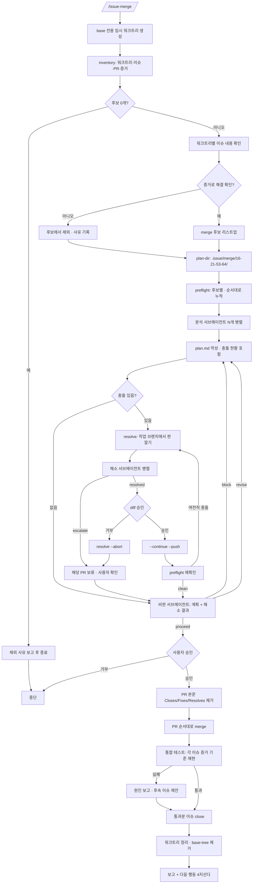

<skill>
  <purpose>
    여러 워크트리에 나뉘어 끝난 작업들을 한꺼번에 기본 브랜치로 합친다.
    개별 PR 을 하나씩 merge 하는 것과 다른 점은, 합친 뒤 서로 깨지지 않았는지 증거 기준으로 재검증한다는 것이다.
    구현과 증거 생성은 `issue-start` 와 `issue-end` 가 이미 끝냈다고 전제한다.
  </purpose>

  <inputs>
    <arg name="$ARGUMENTS" optional="true">대상 이슈 번호 목록. 생략하면 모든 워크트리를 후보로 본다</arg>
    <detected>워크트리 목록, 각 브랜치의 이슈·PR·증거 상태</detected>
  </inputs>

  <preconditions>
    <item>현재 디렉터리가 git 저장소</item>
    <item>트래커 인증 통과 — `~/.issue/settings.json` 의 `provider.type` 이 github 면 `gh auth status`, jira 면 baseUrl·projectKey·토큰. github 인증 실패는 `gh-setup` 스킬로 먼저 해결</item>
    <item>Node 18+</item>
  </preconditions>

  <routing>
    <always>references/ask.md — 단계 이름 정본과 질문·보고·링크 형식. 사용자에게 말을 걸기 전에 읽는다</always>
    <always>references/inventory.md — 워크트리 수집과 이슈 연결</always>
    <always>references/merge-plan.md — 서브에이전트 팬아웃과 계획 수립·검토</always>
    <always>references/verify-and-close.md — merge · 통합 테스트 · 이슈 close</always>
    <always>references/next-actions.md — 통합 뒤 다음 행동 4지선다</always>
  </routing>

  <subagents>
    <agent name="issue-merge-analyst" claude-model="haiku" codex-model="gpt-5.6-luna">
      워크트리 하나씩 분석. 워크트리 개수만큼 병렬로 스폰
    </agent>
    <agent name="issue-merge-resolver" claude-model="sonnet" codex-model="gpt-5.6-terra">
      충돌 헌크를 양쪽 의도를 보존하는 방향으로 해소. 충돌이 있는 워크트리마다 스폰
    </agent>
    <agent name="issue-merge-critic" claude-model="haiku" codex-model="gpt-5.6-luna">
      계획의 모호성·검증되지 않은 전제·되돌릴 수 없는 순서를 지적. 해소 결과도 검토
    </agent>
  </subagents>

  <hard-rules>
    <rule>사용자의 작업 트리에서 브랜치를 갈아타지 않는다. base 전용 임시 워크트리에서만 움직인다.</rule>
    <rule>증거로 해결이 확인되지 않은 이슈는 merge 후보에서 뺀다. 커밋 메시지는 근거가 아니다.</rule>
    <rule>비판 서브에이전트가 `block` 을 내면 계획을 고치기 전에는 merge 하지 않는다.</rule>
    <rule>`preflight` 로 충돌을 확정하기 전에 merge 하지 않는다. `overlapsWith` 는 추측이지 확인이 아니다.</rule>
    <rule>충돌 해소는 작업 브랜치의 워크트리에서 한다. base 브랜치나 base 워크트리에서 해소하지 않는다.</rule>
    <rule>해소 결과는 diff 를 보여주고 승인받은 뒤에만 push 한다. 해소한 쪽이 스스로 승인하지 않는다 — 비판 서브에이전트도 함께 본다.</rule>
    <rule>해소 서브에이전트가 `escalate` 한 파일은 자동으로 합치지 않는다. 그 PR 을 보류한다.</rule>
    <rule>같은 PR 에 대한 해소 재시도는 최대 2회. 그 뒤에는 보류로 넘긴다.</rule>
    <rule>이슈 close 는 통합 테스트 뒤에 한다. 순서를 바꾸지 않는다.</rule>
    <rule>merge 전에 PR 본문의 `Closes/Fixes/Resolves #N` 을 제거한다. 두면 merge 순간 자동 close 되어 위 순서가 깨진다. 제거 실패 시 merge 하지 않는다.</rule>
    <rule>CI 가 실패한 PR 은 merge 하지 않는다.</rule>
    <rule>`evidence/issue-*` 브랜치는 삭제하지 않는다. 증거 URL 이 의존한다.</rule>
    <rule>사용자가 정해야 할 것은 전부 `references/ask.md` 의 질문 블록으로 묻는다. 형식을 즉석에서 만들지 않는다.</rule>
    <rule>merge 는 승인받은 뒤에 한다. 여러 PR 을 묶어서 한 번에 승인받지 않는다.</rule>
    <rule>사용자에게 말을 걸 때는 — 전이 보고든 질문이든 — 현재 단계를 반드시 함께 밝힌다. `references/ask.md` 를 따른다.</rule>
  </hard-rules>

  <non-goals>
    <item>기능 구현과 증거 생성 — `issue-start` / `issue-end` 의 몫</item>
    <item>배포</item>
    <item>이슈 본문 수정</item>
  </non-goals>

  <reporting>
    사용자에게 보이는 모든 출력 — 전이 보고, 질문, 문제 보고, 마무리 요약 — 은 `references/ask.md` 의 형식을 따른다.
    이 스킬은 형식을 따로 정의하지 않는다.

    문제가 생기면 상황 → 문제 → 멀쩡한 것 → 원인 → 선택 순서로 쉬운 말로 보고하고, 마지막은 질문 블록으로 닫는다.
    문제 상황이 아니어도 말을 걸 때는 현재 단계를 함께 밝힌다.
  </reporting>

  <next>
    끝날 때는 항상 다음에 무엇을 할지 골라 준다. references/next-actions.md 의 4지선다를 그대로 쓴다.

    (권장) 은 다음 스킬에 자동으로 붙지 않는다. 남은 작업이 있으면 계속하는 쪽이,
    사용자가 원래 요청한 산출물이 이미 나왔으면 종료하는 쪽이 (권장) 이다.
    이 체인은 스킬마다 다음 스킬을 제시하므로, 기본값을 계속 진행으로 두면
    "검증만 해 달라"는 요청이 이슈·PR·merge 까지 흘러간다. 판단해서 붙인다.
  </next>
</skill>

# 전체 흐름



# 스크립트 경로

아래 중 **존재하는 첫 번째 경로**를 `<skill>` 로 쓴다.

```text
.claude/skills/issue-merge      # 현재 프로젝트 (Claude Code)
.codex/skills/issue-merge       # 현재 프로젝트 (Codex)
~/.claude/skills/issue-merge    # 홈 설치
~/.codex/skills/issue-merge     # 홈 설치
```

`<skill>` 이 `.claude/` 밑이면 실행 계열은 **claude**, `.codex/` 밑이면 **codex** 다.

# 서브에이전트

```text
claude  .claude/agents/issue-merge-analyst.md    (model: haiku)
        .claude/agents/issue-merge-resolver.md   (model: sonnet)
        .claude/agents/issue-merge-critic.md     (model: haiku)
codex   .codex/agents/issue-merge-analyst.toml   (model = "gpt-5.6-luna")
        .codex/agents/issue-merge-resolver.toml  (model = "gpt-5.6-terra")
        .codex/agents/issue-merge-critic.toml    (model = "gpt-5.6-luna")
```

analyst 와 critic 은 판정만 하므로 작은 모델로 충분하다.
**resolver 는 코드를 고친다.** 잘못 합치면 아무도 모르는 회귀가 남으므로 모델을 낮추지 않는다.

없으면 설치한다.

```bash
sh <migrate-skill-agent>/scripts/migrate-skill-agent.sh --agent issue-merge-analyst  --target home --link --clone
sh <migrate-skill-agent>/scripts/migrate-skill-agent.sh --agent issue-merge-resolver --target home --link --clone
sh <migrate-skill-agent>/scripts/migrate-skill-agent.sh --agent issue-merge-critic   --target home --link --clone
```

설치가 안 되면 기본 서브에이전트로 진행하되 "모델 고정 실패"를 한 줄 보고한다.
**비판 단계 자체는 건너뛰지 않는다.** 모델이 무엇이든 계획을 한 번은 깨뜨려 봐야 한다.
resolver 를 고정하지 못했으면 그 사실을 해소 diff 를 보여줄 때 함께 알린다 — 사용자가 더 꼼꼼히 볼 근거가 된다.

# 실행 순서

## 0단계

`references/ask.md` 의 **단계 이름 정본 9줄을 그대로** TodoWrite 항목으로 만든다.
문구를 줄이거나 바꾸지 않는다 — 사용자에게 보이는 단계 표기와 같아야 한다.
**단계가 끝날 때마다 즉시 완료로 갱신한다.**

기본 브랜치로 "변경 이력을 가져가지 않고 checkout" 하되, **사용자의 작업 트리는 건드리지 않는다.**

```bash
node <skill>/scripts/issue-merge.mjs base-tree
```

`.issue/merge/base/` 에 detached 워크트리가 생긴다. 이후 통합 작업은 전부 이 안에서 한다.
이미 있으면 최신 `origin/<base>` 로 맞추기만 한다.

## 1~2단계

```bash
node <skill>/scripts/issue-merge.mjs inventory
```

기본 브랜치보다 앞선 커밋이 없는 워크트리는 **자동으로 빠진다.** 합칠 변경이 없어 판단할 것도 없기 때문이다. 조용히 버리지 않고 `excluded` 에 사유와 함께 남으므로, 회차 보고에 한 줄로 남긴다.

`count` 가 0 이면 합칠 것이 없다. 그 사실과 제외 사유만 보고하고 끝낸다. 계획을 세우거나 서브에이전트를 띄우지 않는다.

세부는 `references/inventory.md`.

## 3단계

각 워크트리의 이슈 완료 기준과 증거를 대조한다. `references/inventory.md` 의 판정 규칙을 따른다.

## 4~5단계

```bash
node <skill>/scripts/issue-merge.mjs plan-dir 16 21 53 64
node <skill>/scripts/issue-merge.mjs preflight --branch <브랜치>            # 후보마다
node <skill>/scripts/issue-merge.mjs preflight --branch <브랜치> --onto <commit>   # 계획 순서대로 누적
```

`.issue/merge/16-21-53-64/` 가 생긴다. 여기에 `plan.md` 와 `review.md` 를 쓴다.

**`preflight` 를 먼저 돌린다.** merge 순서는 파일 수가 아니라 여기서 확정된 충돌 관계로 정한다.
`--onto` 로 앞 회차의 `commit` 을 이어 넘겨야 "혼자서는 통과하는데 순서 때문에 깨지는" 경우가 잡힌다.

충돌이 있으면 `resolve` 로 작업 브랜치 쪽에서 해소하고, diff 를 승인받은 뒤에 push 한다.
충돌이 0건이면 해소 절을 통째로 건너뛴다.

세부는 `references/merge-plan.md`.

## 6~7단계

`references/verify-and-close.md` 를 따른다.

`close` 는 이슈를 닫기 직전에 진행 상태 라벨을 `status:close` 로 교체한다(자동). 별도 호출이 필요 없다.

## 8단계

`references/next-actions.md` 의 4지선다를 그대로 제시한다.

## 마무리 보고

```text
대상        <n>개 워크트리 / [#16](url) [#21](url) [#53](url) [#64](url)
충돌        <n>건 감지 / <n>건 해소 / <n>건 보류
merge 됨    [#16](url) [#21](url) [#53](url)
보류        [#64](url) — <사유>
통합 테스트  <통과/실패 요약>
close 됨    [#16](url) [#21](url) [#53](url) (status:close)
정리        워크트리 <n>개 제거 / base-tree 제거
남은 것     <다음에 해야 할 것>
다음        <사용자가 고른 행동>

현재 단계 — issue-merge 8단계(다음 행동 선택) 완료
```

링크와 경로는 `references/ask.md` 5절을 따른다 — 이슈 번호는 `inventory` 출력의 `issueUrl`, 워크트리 경로는 `display` 값을 쓴다.
